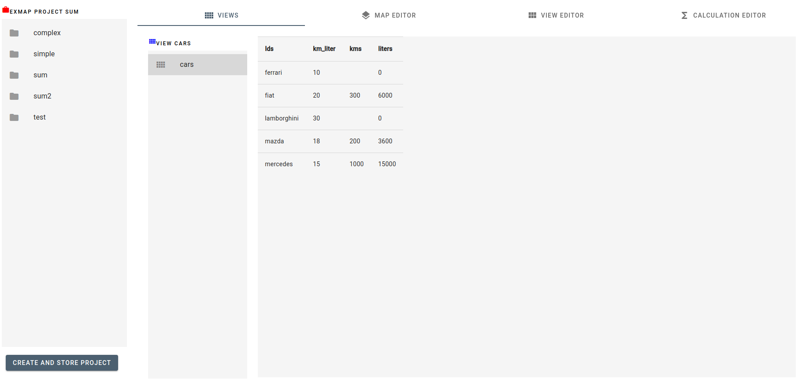

# Exmap

A **spreadsheet application** based on [maps](../../wiki/Maps) (key-values), instead of cells. 

Because of this the **integration** with other systems, with databases and with key-value stores becomes very easy.

Its [web interface](../../wiki/UI%3A.Projects) allows [multiple users](../../wiki/Architecture) to edit the same spreadsheet in the same time.
 

